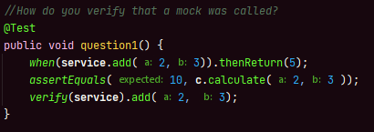
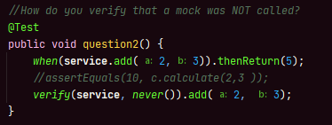
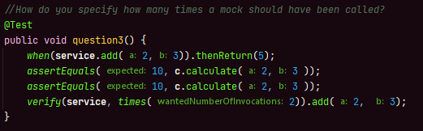
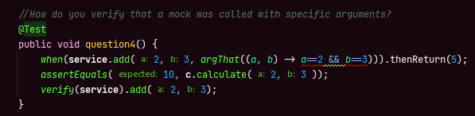
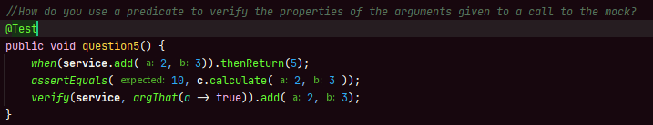
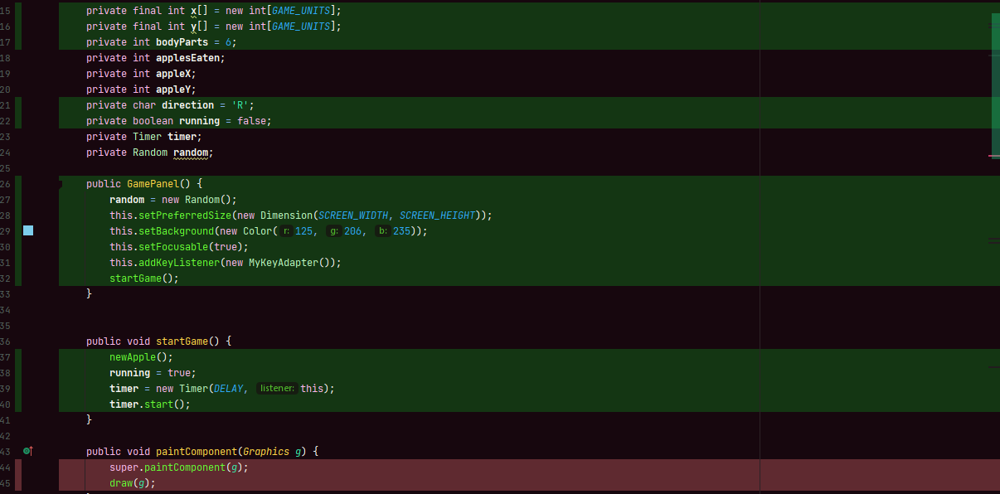
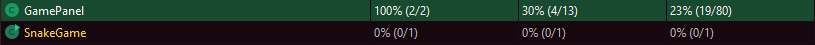

# Assignment 4
**Sebastian Bentley - cph-sb287**
All of the code can be found within this repository.

## 1. Mockito Powerups
- How do you verify that a mock was called? 

**answer:** You use the *verify()* method.

- How do you verify that a mock was NOT called? 

**answer:** You use the *never()* method as parameter in the verification, notice some code is commented out, because the *never()* method will fail, if it wasn't.

- How do you specify how many times a mock should have been called?

**answer:** You use the *times()* method as parameter in the verify.

- How do you verify that a mock was called with specific arguments?

**answer:** with the *argThat()* method in the *when* call, could not quite figure the syntax out... oh well..

- How do you use a predicate to verify the properties of the arguments given to a call to the mock?

**answer:** with the *argThat()* method in the *verify* call, could not quite figure the syntax out... oh well..

## 2. The code
The snake found here: [snake](https://github.com/SebastianBentley/softTestAssignments/tree/main/assignment4/TestAssignment4/src/main/java/snake/GamePanel.java)
To play the game, simply run the main in the [snake](https://github.com/SebastianBentley/softTestAssignments/tree/main/assignment4/TestAssignment4/src/main/java/snake/SnakeGame.java) main method.

Code coverage is done by selecting the option *run with code coverage* when running tests. I did not write that many test, since we have waaaay to much to do with the exam.
However, here is what the code coverage info looks like:

